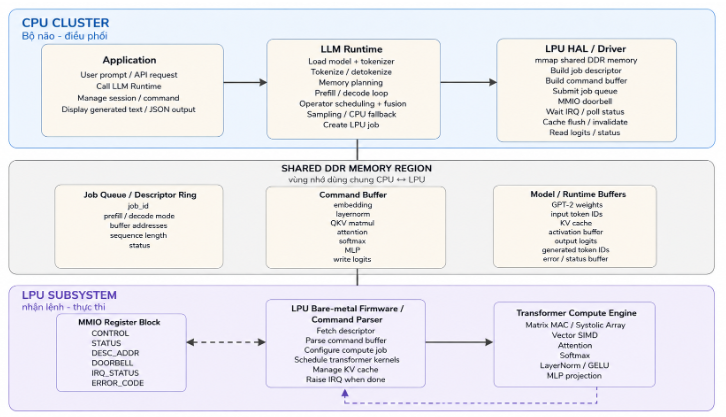

+++
title = "4.6.2 Architect overview"
weight = 2
+++

# 4.6.2  Architect overview
Hệ thống giữa CPU và LPU gồm ba khối chính, chúng giao tiếp qua vùng nhớ chia sẻ (shared DDR/SRAM), kết hợp doorbell qua MMIO và tín hiệu ngắt báo hoàn thành (completion IRQ).

