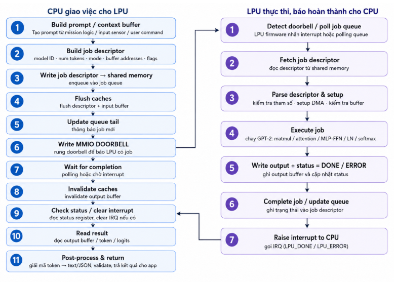

+++
title = "4.6.4 Communication flow"
weight = 4
+++
 
# 4.6.4 Communication flow

Ở trạng thái ổn định, CPU chỉ đóng vai trò điều phối: tạo prompt, tokenize, chuẩn bị buffer/job descriptor, cập nhật job queue và rung doorbell để giao việc cho LPU. Bare-metal firmware trên LPU nhận job, đọc descriptor, cấu hình phần cứng và điều khiển Compute Engine thực thi các phép toán của GPT-2 như MatMul, Attention, MLP/FFN và Softmax. Sau khi hoàn thành, LPU cập nhật trạng thái DONE/ERROR, CPU invalidate output cache, đọc kết quả và thực hiện post-processing

