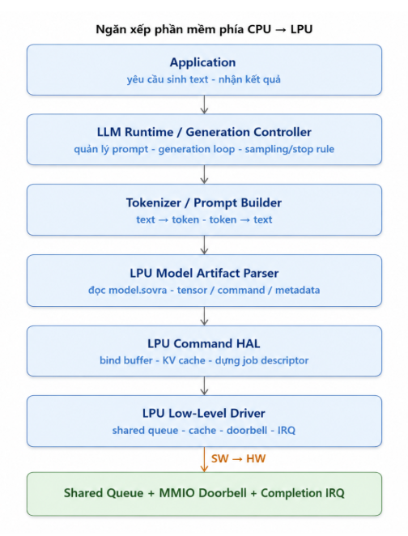
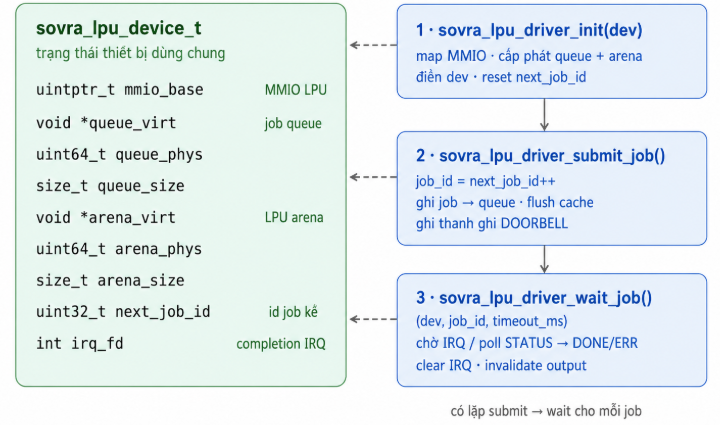
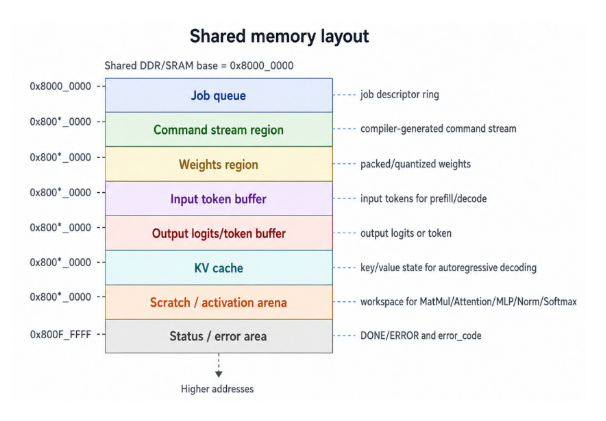
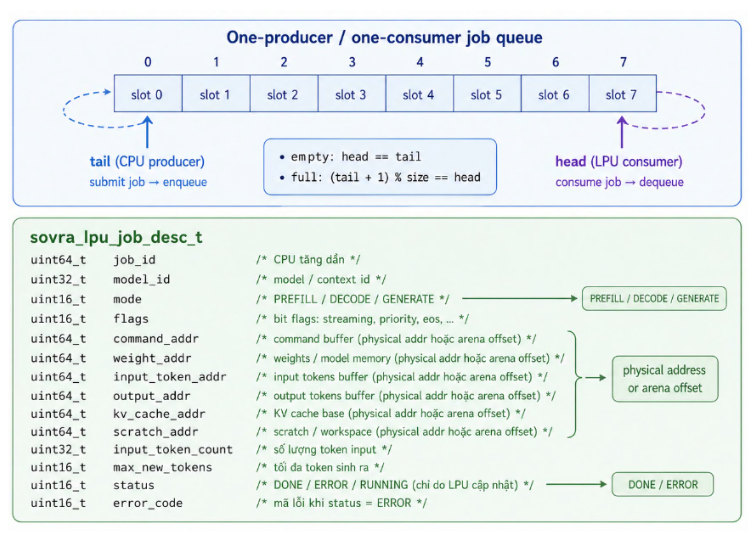
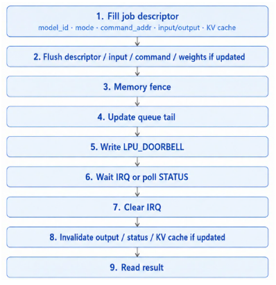
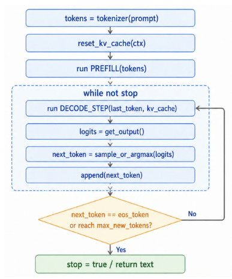
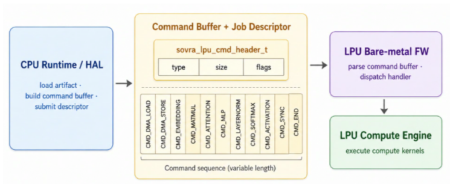
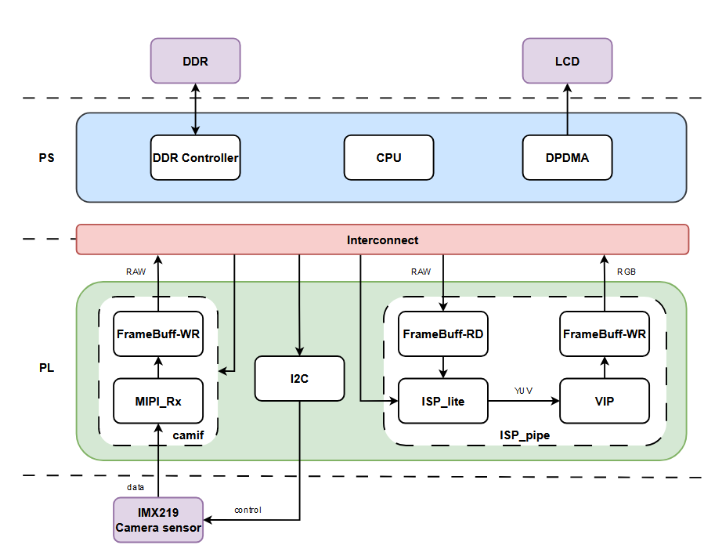
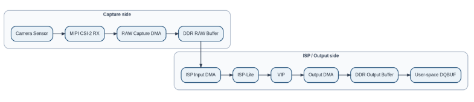

+++
title = "4.6.7 CPU Software Stack Design"
weight = 7
+++

# 4.6.7 CPU Software Stack Design

Phần mềm phía CPU cho LPU được tổ chức theo nhiều lớp, từ tầng ứng dụng đến low-level driver. Ứng dụng chỉ gửi yêu cầu sinh text và nhận kết quả. LLM Runtime chịu trách nhiệm quản lý generation loop, bao gồm prompt context, số token tối đa, stop rule và quá trình sinh token lặp lại. Tokenizer / Prompt Builder chuyển đổi text thành token ID trước khi gửi cho LPU và chuyển output token về text sau khi hoàn thành.

## 4.6.7.1 Application Layer

Tầng ứng dụng điều phối luồng dữ liệu ở mức cao và không tiếp xúc trực tiếp với phần cứng:

- Nhận yêu cầu từ user command, mission logic, hoặc kết quả từ NPU.
- Tạo yêu cầu sinh text / sinh quyết định / sinh phản hồi.
- Gọi LLM runtime để chạy inference trên LPU.
- Nhận kết quả cuối cùng dưới dạng text, token hoặc decision.
- Gửi kết quả cho tầng ứng dụng, UI, robot controller hoặc module tiếp theo.

**Tầng ứng dụng KHÔNG:**

- Không trực tiếp quản lý token buffer.
- Không trực tiếp thao tác KV cache.
- Không ghi MMIO doorbell.
- Không xử lý command stream.
- Không biết chi tiết MatMul, Attention, MLP, LayerNorm, Softmax.
- Không biết offset thanh ghi, cache flush, IRQ hoặc layout bộ nhớ LPU.

## 4.6.7.2 LLM Runtime / Generation Controller

LLM Runtime là tầng điều phối chính của quá trình inference ở phía CPU. Runtime không trực tiếp thực hiện từng phép toán của Transformer, mà chịu trách nhiệm load model artifact, quản lý prompt/token, chuẩn bị buffer, tạo job descriptor và gọi LPU thực thi các bước inference.
Nhiệm vụ chính của Runtime được phân theo các giai đoạn sau:

### Parse model

- Đọc và xác thực artifact header, bao gồm magic number, version, model ID và checksum.
- Parse model config như số layer, hidden size, vocab size, number of heads, context length và precision.
- Deserialize tokenizer/vocab, tensor table, operator/layer schedule, quantization metadata và weight metadata.
- Dựng các thông tin cần thiết để Runtime biết model cần chạy như thế nào trên LPU.

### Prepare prompt / input

- Nhận prompt text hoặc mission context từ application.
- Gọi tokenizer để chuyển text thành token IDs.
- Chuẩn bị input token buffer, position ID, attention mask nếu cần.
- Khởi tạo decode state, bao gồm current token index, max new tokens, stop rule và output buffer.

### Cấp phát bộ nhớ

- Cấp phát / ánh xạ vùng nhớ cho input tokens, output tokens, logits, intermediate tensor và scratch buffer.
- Cấp phát vùng nhớ cho weights đã được pack/quantize.
- Cấp phát và quản lý KV cache cho quá trình autoregressive decoding.
- Đảm bảo buffer address phù hợp với memory plan trong model artifact và có thể được LPU firmware truy cập.

### Manage input/output tensors

- Quản lý input tensor và output tensor mà application trao đổi với Runtime.
- Theo dõi output logits hoặc output token do LPU trả về.
- Cập nhật token mới vào context sau mỗi decode step.
- Quản lý output cuối cùng dưới dạng text, JSON hoặc Mission DSL command.

### Phân tích graph và phân bổ task

- Phân tích operator/layer schedule ở mức execution.
- Quyết định operator hoặc layer nào chạy trên LPU, operator nào fallback về CPU nếu phần cứng chưa hỗ trợ.
- Fuse các operator tương thích nếu có thể để giảm số lượng command và giảm traffic memory.
- Bảo toàn data dependency giữa các layer Transformer, KV cache và output logits.

### Chuẩn bị và submit job

- Điều khiển vòng sinh token autoregressive.
- Sau mỗi lần LPU trả logits/token, Runtime thực hiện sampling policy nếu sampling nằm phía CPU, ví dụ greedy, top-k, top-p hoặc temperature.
- Kiểm tra điều kiện dừng như max_new_tokens, eos_token hoặc stop sequence.
- Append token mới vào context và tiếp tục gọi LPU cho đến khi hoàn thành.
- Decode token thành text/JSON và trả kết quả cuối cùng cho application.

## 4.6.7.3 Tokenizer / Prompt Builder

Tokenizer / Prompt Builder chịu trách nhiệm chuyển đổi giữa text và token. Tầng này tạo prompt từ user command, mission logic, NPU result và system context, sau đó chuyển prompt thành token ID trước khi gửi cho LPU.

- Thêm special token nếu cần: BOS (Beginning Of Sequence), EOS (End Of Sequence), PAD (Padding), UNK (Unknown).
- Cắt hoặc nén context nếu vượt context_length.
- Chuyển output token ID thành text sau khi LPU trả kết quả.
- Đọc tokenizer type, vocab/merge table, special token ID và output token format từ metadata trong artifact.

## 4.6.7.4 LPU Model Artifact Parser

LPU Model Artifact Parser load và kiểm tra model.sovra, bao gồm header, tensor/buffer table, command stream, weights và metadata. Parser không chạy model; nó chỉ biến artifact thành runtime model handle để HAL sử dụng.

- Kiểm tra magic, version, model_id và checksum.
- Kiểm tra target_lpu_version và command ABI compatibility.
- Parse tensor/buffer table, command stream, weights, quantization meta, tokenizer meta và KV cache layout.
- Tạo model handle chứa pointer/offset tới các section cần dùng khi tạo context và job descriptor.

## 4.6.7.5 LPU HAL API

HAL cung cấp giao diện ổn định, độc lập với từng model cụ thể. Runtime phía CPU gọi HAL để load model artifact, tạo context, bind input/output buffer, bind KV cache và submit job xuống LPU.

| Hàm | Chức năng |
| --- | --- |
| `sovra_lpu_init` | Khởi tạo thiết bị LPU |
| `sovra_lpu_query_caps` | Truy vấn năng lực phần cứng/firmware |
| `sovra_lpu_load_model` | Nạp LPU model artifact |
| `sovra_lpu_create_context` | Tạo runtime context từ model |
| `sovra_lpu_reset_kv_cache` | Reset KV cache khi bắt đầu prompt mới |
| `sovra_lpu_set_input_tokens` | Gán input token buffer |
| `sovra_lpu_run` | Chạy một inference job hoặc decode step |
| `sovra_lpu_get_output` | Lấy logits/token output |
| `sovra_lpu_destroy_context` | Giải phóng context |
| `sovra_lpu_unload_model` | Gỡ model khỏi runtime |

## 4.6.7.6 LPU Low Level Driver

LPU Low-Level Driver là tầng giao tiếp trực tiếp với phần cứng LPU. Tầng này không hiểu model và không xử lý logic LLM. Nhiệm vụ của driver là cung cấp các thao tác cơ bản như map thanh ghi MMIO, cấp phát shared memory, submit job descriptor vào shared queue, flush/invalidate cache, rung doorbell, xử lý completion IRQ và đọc status/error code.
Driver nhận job descriptor đã được HAL chuẩn bị sẵn. Descriptor này chứa địa chỉ vật lý hoặc offset của command stream, input token buffer, output logits/token buffer, weights, KV cache và scratch buffer. Sau khi ghi descriptor vào shared queue, driver flush cache, cập nhật queue tail và ghi MMIO doorbell để đánh thức LPU. Khi LPU hoàn thành, driver nhận IRQ, clear interrupt, invalidate output/status buffer và trả kết quả về HAL.

Các hàm chính:

| Hàm | Chức năng |
| --- | --- |
| `sovra_lpu_driver_init(dev)` | Map MMIO, cấp phát/map shared queue + arena, reset next_job_id, cấu hình queue base cho LPU |
| `sovra_lpu_driver_submit_job(dev, desc)` | Gán job_id, ghi job descriptor vào shared queue, flush cache, update queue tail, ghi thanh ghi LPU_DOORBELL |
| `sovra_lpu_driver_wait_job(dev, job_id, timeout_ms)` | Chờ IRQ hoặc poll status, đọc DONE/ERROR, clear IRQ, invalidate output/status buffer |
| `sovra_lpu_driver_reset(dev)` | Reset LPU hoặc reset queue khi timeout/hang |
| `sovra_lpu_driver_close(dev)` | Unmap MMIO, giải phóng queue/arena |

4.6.7.7  Shared Memory 
Vùng nhớ chia sẻ được phân khu cố định để CPU và LPU cùng thống nhất vị trí của queue, descriptor, command stream, weights, input/output buffer, KV cache và scratch buffer. Descriptor và command stream nên dùng địa chỉ vật lý hoặc offset trong arena thay vì con trỏ ảo của CPU.

Giả dụ gốc tại 0x8000_0000:

4.6.7.8  Job Queue  
Hàng đợi là ring buffer một-producer/một-consumer: CPU là producer, LPU là consumer. 
CPU sở hữu tail, LPU sở hữu head. Queue cần tránh đặt head, tail và descriptor trên cùng cache line.

4.6.7.9  MMIO Registers 

Khối điều khiển LPU_CTRL là một slave AXI4-Lite, tương tự như NPU.
Team software cần những thanh ghi được liệt kê trong bảng dưới đây để giao tiếp với LPU (Phần này sẽ được cung cấp bởi team chịu trách nhiệm thiết kế LPU):

Offset
Thanh ghi
Ý nghĩa
0x00
QUEUE_BASE_LO
Địa chỉ gốc hàng đợi (32 bit thấp)
0x04
QUEUE_BASE_HI
Địa chỉ gốc hàng đợi (32 bit cao)
0x08
QUEUE_SIZE
Kích thước hàng đợi
0x0C
DOORBELL
CPU ghi để đánh thức NPU
0x10
STATUS
Trạng thái tổng hợp
0x14
IRQ_STATUS
Bit báo thức cho CPU
0x18
IRQ_CLEAR
CPU ghi để xoá ngắt
0x1C
NPU_ACK
NPU ghi để xác nhận đã nhận doorbell
0x20
NPU_DONE
NPU ghi để báo hoàn thành
0x24
VERSION
Phiên bản RTL/firmware

4.6.7.10  Submit Flow
Trình tự nộp job: điền descriptor -> flush dữ liệu chia sẻ -> fence -> cập nhật tail -> ghi doorbell. Thứ tự này là bắt buộc để LPU không đọc phải descriptor, input token hoặc command stream cũ.

4.6.7.11  Cache Synchronization Rules
Khi CPU và LPU không cache-coherent, phải tuân thủ trình tự flush/invalidate sau:
Trước doorbell: flush job descriptor, command stream, input token buffer, tail pointer, weights nếu vừa cập nhật và KV cache nếu CPU vừa ghi.
Đặt memory fence sau flush và trước khi ghi DOORBELL.
Sau khi hoàn thành: invalidate job descriptor/status, output logits/token buffer và KV cache nếu LPU vừa cập nhật.
Không đặt head, tail và descriptor dùng chung trên cùng một cache line 
4.6.7.12  Runtime Scheduling 
Với LPU, scheduler không duyệt pixel/frame như NPU vision pipeline mà điều phối prefill/decode loop. Runtime quyết định lúc nào chạy PREFILL để tạo KV cache, lúc nào chạy DECODE_STEP để sinh token tiếp theo, và lúc nào dừng theo eos_token, max_new_tokens hoặc stop rule.

4.6.7.13  LPU Execution Modes
LPU inference được chia thành hai chế độ chính:

1. PREFILL
Xử lý toàn bộ prompt/input tokens ban đầu.
Tạo hidden states và khởi tạo KV cache cho tất cả layer.
Thường có sequence length dài hơn, workload lớn hơn decode step. 
2. DECODE_STEP
Xử lý token mới nhất dựa trên KV cache đã có.
Cập nhật KV cache bằng key/value của token mới.
Sinh logits hoặc output token tiếp theo.
Lặp lại cho đến khi gặp eos_token, stop sequence hoặc max_new_tokens. 
Runtime phía CPU quyết định khi nào chạy PREFILL, khi nào chạy DECODE_STEP và khi nào dừng generation. 
4.6.8 Job Descriptor Layout

Field
Ý nghĩa
job_id
ID duy nhất của job
abi_version
Phiên bản abi mà descriptor sử dụng
job_type
PREFILL / DECODE_STEP / LOAD_WEIGHTS / RESET_KV
model_id
Model đang chạy
command_buffer_addr
Địa chỉ vật lý / offset command stream
command_buffer_size
Kích thước command stream
input_token_addr
Buffer chứa token đầu vào
input_token_count
Số token đầu vào
position_start
Vị trí token bắt đầu trong context
kv_cache_addr
Vùng KV cache
kv_cache_size
Kích thức KV cache
weight_base_addr
Vùng weights đã pack/quantize
scratch_addr
Vùng scratch/intermediate
logits_output_addr
Buffer logits đầu ra
Output_token_addr
Buffer token đầu ra
status_addr
Vùng ghi DONE/ERROR/status code

4.6.10 Command ABI Between CPU and LPU 
Phần này đặc tả Command ABI mà LPU bare-metal firmware tiêu thụ. ABI phải ổn định và được đánh version để CPU runtime, artifact và firmware kiểm tra tương thích trước khi thực thi.

4.6.10.1  Command ABI Version
#define SOVRA_LPU_ABI_VERSION_MAJOR 1
#define SOVRA_LPU_ABI_VERSION_MINOR 0
#define SOVRA_LPU_ABI_VERSION     ((SOVRA_LPU_ABI_VERSION_MAJOR << 16) | SOVRA_LPU_ABI_VERSION_MINOR)
 
Lệch MAJOR là lỗi không tương thích. MINOR cao hơn có thể được chấp nhận theo hướng tương thích ngược nếu firmware có thể bỏ qua các field hoặc command extension chưa dùng.
4.6.10.2  Command List
typedef enum {
	SOVRA_LPU_CMD_NOP    	  = 0,
	SOVRA_LPU_CMD_DMA_LOAD   = 1,
	SOVRA_LPU_CMD_DMA_STORE  = 2,
	SOVRA_LPU_CMD_EMBEDDING  = 3,
	SOVRA_LPU_CMD_MATMUL 	  = 4,
	SOVRA_LPU_CMD_ATTENTION  = 5,
	SOVRA_LPU_CMD_MLP    	  = 6,
	SOVRA_LPU_CMD_LAYERNORM  = 7,
	SOVRA_LPU_CMD_SOFTMAX	  = 8,
	SOVRA_LPU_CMD_ACTIVATION = 9,
	SOVRA_LPU_CMD_SYNC       = 10,
	SOVRA_LPU_CMD_END    	  = 255,
} sovra_lpu_cmd_type_t;
 
4.6.10.3  Command Header
Mỗi command có kích thước thay đổi và bắt đầu bằng một header chung. Firmware dịch con trỏ command theo trường size và dừng tại CMD_END.
typedef struct {
	uint16_t type;
	uint16_t size;  	/* tổng kích thước command, tính bằng byte */
	uint32_t flags;
} sovra_lpu_cmd_header_t;
 
Quy tắc: mọi command mở đầu bằng sovra_lpu_cmd_header_t; firmware tiến con trỏ theo hdr.size; CMD_END kết thúc command buffer.

4.7  ISP Design
4.7.1 Tổng quan và phạm vi thiết kế
Tài liệu này mô tả thiết kế phần mềm cho pipeline xử lý ảnh sử dụng camera IMX219. Hệ thống bao gồm các IP chính như Camera Sensor, MIPI CSI-2 RX, ISP-lite, VIP.
Phần mềm chịu trách nhiệm cấu hình pipeline, quản lý buffer hình ảnh, xử lý interrupt và đồng bộ luồng dữ liệu giữa các thành phần phần cứng. Mục tiêu là cung cấp một pipeline xử lý ảnh hoàn chỉnh từ thu nhận hình ảnh đến ghi frame vào DDR, sẵn sàng cho NPU đọc
Hạng mục
Quyết định thiết kế / quy ước
Pipeline chính
IMX219  → MIPI CSI-2 RX → Ram Buffer → ISP-lite → VIP → DDR(output)
Chức năng phần mềm 
Cấu hình và điều khiển pipeline thông qua V4L2/media-controller; quản lý buffer, format, stream on/off, interrupt và queue dữ liệu. 
Phạm vi tài liệu 
Mô tả kiến trúc phần mềm, luồng dữ liệu, buffer ownership và synchronization points giữa các IP. 

Top architecture of ISP system

4.7.2 2. KIẾN TRÚC CAMERA PIPELINE
4.7.2.1 Data Path End-to-End
Data path là đường đi của dữ liệu ảnh từ sensor tới user-space. Với baseline một output, data path được thiết kế như sau:

Khối
Vai trò trong data path
Sensor
Phát RAW Bayer stream qua MIPI CSI-2
MIPI CSI-2 RX
Nhận CSI-2 packet và tạo RAW pixel stream nội bộ
RAW Capture DMA
Ghi RAW stream xuống DDR RAW buffer
DDR RAW Buffer
Boundary giữa capture side và ISP side
ISP Input DMA
Đọc RAW buffer và phát stream vào ISP
ISP-Lite
Xử lý RAW/Y input thành stream ảnh đã xử lý
VIP
Crop/scale/CSC/pack theo output requirement
Output DMA
Ghi frame cuối xuống DDR output buffer
User-space
Nhận frame qua DQBUF trên output video node

